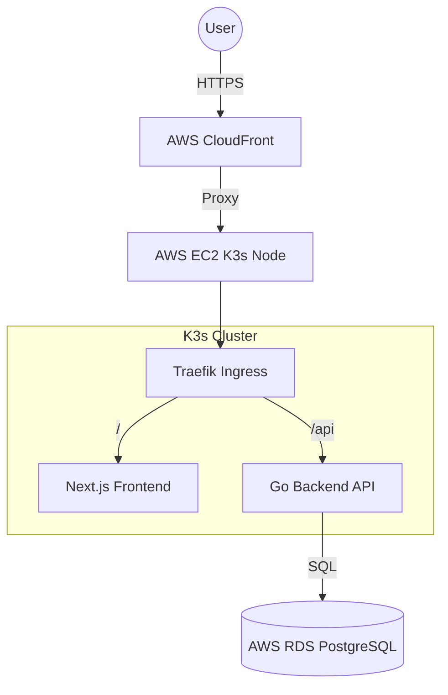

# Money Manager

A comprehensive financial management application designed to help users and organizations track expenses, income, and overall financial health. Built with a modern "Clean Fintech" aesthetic using Next.js, Go, and Cloud-Native infrastructure.

## 🚀 Features

-   **Financial Dashboard**: Real-time overview of total balance, income, expenses, and recent transactions.
-   **Transaction Management**:
    -   Log Income and Expenses with categories.
    -   **Family & Group Support**: Organize transactions by personal, family, or specific groups.
-   **Goals & Savings**: Set financial goals and track progress visually.
-   **Secure Authentication**: JWT-based login and registration system.
-   **Responsive Design**: Mobile-first UI tailored for all devices.

## 🛠 Tech Stack

### Frontend
-   **Framework**: Next.js 16 (App Router)
-   **Language**: TypeScript
-   **Styling**: Tailwind CSS v4, Shadcn/UI (Radix Primitives)
-   **Charts**: Recharts
-   **Auth**: NextAuth.js

### Backend
-   **Language**: Go (Golang) 1.25+
-   **Router**: Chi
-   **Database**: PostgreSQL (AWS RDS)
-   **Auth**: Custom JWT Middleware

### Infrastructure
-   **Cloud Provider**: AWS (ap-south-1)
-   **Orchestration**: K3s (Lightweight Kubernetes) on EC2
-   **IaC**: Terraform (VPC, EC2, RDS, CloudFront)
-   **CDN**: AWS CloudFront for secure and fast delivery
-   **Ingress**: Traefik

## 🏗 Architecture



## 📂 Project Structure

```bash
.
├── frontend/           # Next.js Web Application
│   ├── app/            # App Router (Pages & Actions)
│   ├── components/     # UI Components (Shadcn)
│   └── lib/            # Utilities
├── backend/            # Go API Service
│   ├── cmd/server/     # Entry Point
│   ├── internal/       # Controllers, Models, Middleware
│   └── config/         # Configuration
├── k8s/                # Kubernetes Manifests (Deployment, Service, Ingress)
├── terraform/          # Infrastructure as Code (AWS Resources)
└── docs/               # Product Requirements (PRD) & Assets
```

## ⚡ Getting Started

### Prerequisites
-   Go 1.25+
-   Node.js 20+
-   Docker
-   PostgreSQL

### Local Development

1.  **Clone the repository**
    ```bash
    git clone https://github.com/Ab-hinav/money-manager.git
    cd money-manager
    ```

2.  **Backend Setup**
    Navigate to `backend/` and create a `.env` file (see `config/config.go`).
    ```bash
    cd backend
    go mod download
    go run cmd/server/main.go
    # Server runs on http://localhost:8080
    ```

3.  **Frontend Setup**
    Navigate to `frontend/` and create a `.env` file.
    ```env
    NEXT_PUBLIC_API_URL=http://localhost:8080
    NEXTAUTH_SECRET=your-secure-secret
    NEXTAUTH_URL=http://localhost:3000
    ```
    Install dependencies and run:
    ```bash
    cd frontend
    npm install
    npm run dev
    # App runs on http://localhost:3000
    ```

## 📖 Documentation
For detailed product requirements and design specs, see [docs/PRD_live.txt](docs/PRD_live.txt).
