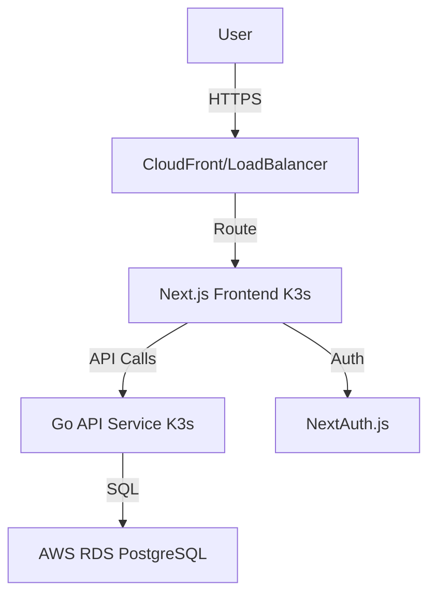

# Money Manager

A comprehensive financial management application designed to provide users and organizations with a clear view of their expenses, savings, and overall financial health.

## Key Features

-   **Secure Authentication**: Robust JWT-based login and registration system using NextAuth.js.
-   **Interactive Dashboard**: Real-time overview of financial status and recent activity.
-   **Transaction Management**: 
    -   Record Income and Expenses.
    -   **Family & Group Support**: Organize transactions by personal, family, or specific groups (e.g., Vacation, Business).
-   **Responsive Design**: Mobile-first "Clean Fintech" aesthetic using Tailwind CSS and Shadcn/UI.
-   **Cloud Native**: containerized with Docker and orchestrated via K3s on AWS.

## Tech Stack

### Frontend
-   **Framework**: [Next.js](https://nextjs.org/) (App Router)
-   **Language**: TypeScript
-   **Styling**: Tailwind CSS v4
-   **UI Components**: Shadcn/UI (Radix Primitives + Lucide Icons)
-   **State/Auth**: Server Actions, NextAuth.js

### Backend
-   **Language**: Go (Golang)
-   **Router**: Chi
-   **Database**: PostgreSQL (AWS RDS)
-   **Auth**: JWT (JSON Web Tokens) with BCrypt hashing

### Infrastructure
-   **Cloud Provider**: AWS (ap-south-1)
-   **IaC**: Terraform (VPC, EC2, RDS)
-   **Orchestration**: K3s (Lightweight Kubernetes)
-   **CI/CD**: GitHub Actions

## Architecture



## Project Structure

```bash
.
├── frontend/           # Next.js Web Application
│   ├── app/            # App Router Pages, Actions & API Routes
│   ├── components/     # UI Components (Shadcn & Custom)
│   └── lib/            # Utilities & Auth Configuration
├── backend/            # Go API Service
│   ├── cmd/server/     # Entry Point
│   └── internal/       # Application Logic (Controllers, Models)
├── k8s/                # Kubernetes Manifests (Deployments, Services)
├── terraform/          # Infrastructure as Code (AWS Resources)
└── docs/               # Product Requirements (PRD) & Assets
```

## Getting Started

### Prerequisites
-   Go 1.25+
-   Node.js 20+
-   Docker
-   Terraform (optional for cloud deployment)
-   PostgreSQL (local or remote)

### Local Development

1.  **Clone the repository**
    ```bash
    git clone https://github.com/Ab-hinav/money-manager.git
    cd money-manager
    ```

2.  **Backend Setup**
    Navigate to `backend/` and create a `.env` file (refer to `config/config.go` for required keys).
    ```bash
    cd backend
    go mod download
    go run cmd/server/main.go
    # Server running on localhost:8080
    ```

3.  **Frontend Setup**
    Navigate to `frontend/` and create a `.env` file:
    ```env
    NEXT_PUBLIC_API_URL=http://localhost:8080
    NEXTAUTH_SECRET=your-secure-secret
    NEXTAUTH_URL=http://localhost:3000
    ```
    Run the development server:
    ```bash
    cd frontend
    npm install
    npm run dev
    # App available at http://localhost:3000
    ```

## Documentation
For detailed product requirements and design specs, see [docs/PRD_live.txt](docs/PRD_live.txt).
